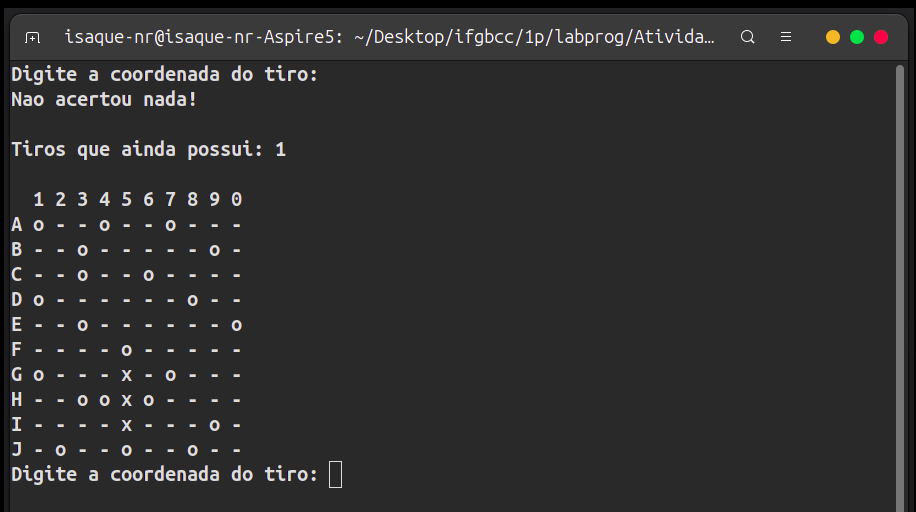
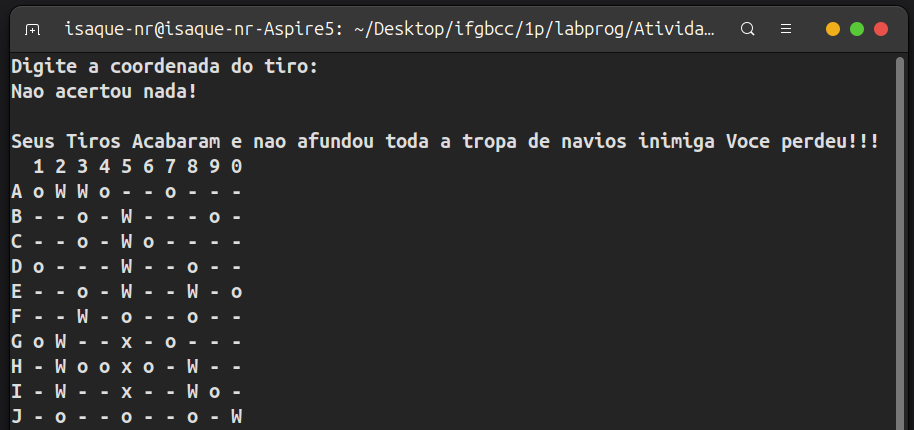

# Batalha Naval em C

<p align="center">
  
  
</p>

Projeto desenvolvido no **1º período de Ciência da Computação** como atividade de Laboratório de Programação.

O projeto consiste em uma versão simplificada do jogo **Batalha Naval**, executada em modo texto no terminal, utilizando uma matriz `10x10`, mas eu fiz toda lógica com uma matriz `11x11` para representar o tabuleiro. Os navios são posicionados aleatoriamente e o jogador possui **25 tiros** para encontrar todos eles.

## Objetivos

O projeto foi desenvolvido principalmente para praticar:

* Matrizes e manipulação de arrays bidimensionais;
* Laços de repetição e loops aninhados;
* Funções em C;
* Geração de números aleatórios;
* Validação de entradas;
* Lógica de programação;
* Organização e divisão do código em funções.

## Funcionalidades

* Tabuleiro de Batalha Naval em modo texto;
* Posicionamento aleatório dos navios;
* Navios de diferentes tamanhos;
* Verificação de acertos e erros;
* Controle de tiros restantes;
* Impedimento de tiros repetidos;
* Verificação de vitória ou derrota;
* Exibição do mapa final com os navios revelados.

## Tecnologias

* **C**
* **GCC**
* **Terminal Linux**

## Como executar

### Pelo Code::Blocks

1. Abra o **Code::Blocks**.
2. Crie ou abra um projeto em C.
3. Adicione o arquivo `main.c` ao projeto.
4. Compile e execute utilizando **Build and Run** (`F9`).

### Pelo CMD / Terminal

Caso queira executar o programa diretamente pelo terminal, é necessário ter o **GCC** instalado.

Navegue até a pasta onde está o arquivo `main.c` e execute:

```bash
gcc main.c -o BatalhaNaval
```

Depois, execute o programa:

**Windows (CMD):**

```cmd
BatalhaNaval.exe
```

**Linux:**

```bash
./BatalhaNaval
```

Com isso boa sorte porque é bem difícil eu mesmo nunca consegui ganhar.

